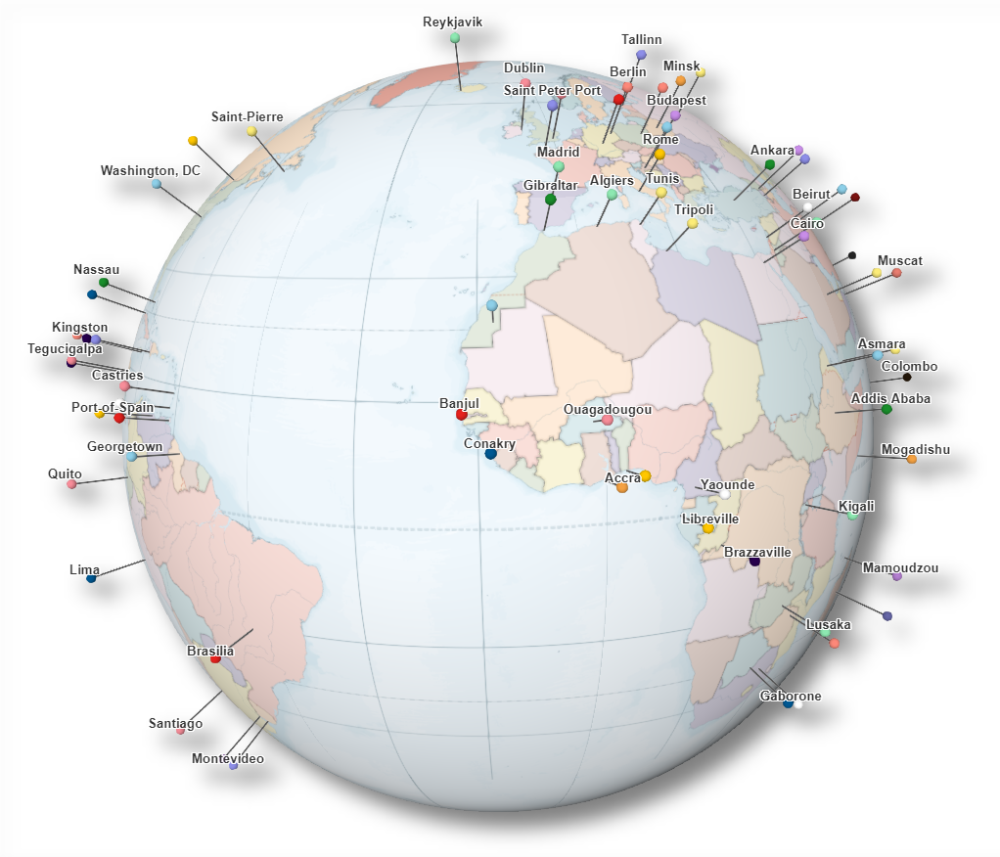

# Tutorial - Getting started with web 3D using ArcGIS API for JavaScript

In this tutorial you'll learn how to create a globe visualization of places you've been to. Something like this pin globe (the style is all up to you, you can get creative and style it totally different):



For this tutorial you'll need to have the data in [geojson](http://geojson.org/) format and like all things web, make sure to have `node` and `git` installed. It's useful if you have a [GitHub account](https://github.com/) so that we can host the code there and deploy it at the end on [GitHub Pages](https://pages.github.com/).

## Step 1: Set up the project and development environment

### Set up your project

Create the folder for your project and inside it in the console run `npm init`. Fill up project name, keywords, author, etc.
This will generate a `package.json` file.

### Set up a git repo

In the terminal run `git init` in the root folder. Create a `.gitignore` file and add
```
node_modules/*
.DS_Store
```
to exclude them from `git`.

### Set up app structure

Create an `index.html` file and an `app` folder that will store the JS/TS code and a style folder that will store the CSS.

- index.html
- app -> main.js
- style -> main.css

### Set up TypeScript

```
npm install --save-dev typescript
npm install --save @types/arcgis-js-api
```

Add `tsconfig.json` file with the following configuration:

```js
{
  "compilerOptions": {
    "module": "amd",
    "noImplicitAny": true,
    "sourceMap": true,
    "jsx": "react",
    "jsxFactory": "tsx",
    "target": "es5",
    "esModuleInterop": true,
    "experimentalDecorators": true,
    "preserveConstEnums": true,
    "suppressImplicitAnyIndexErrors": true
  },
  "include": [
    "./app/*"
  ],
  "exclude": [
    "node_modules"
  ]
}
```

Add a script in `package.json` to watch for changes and compile everytime a `.ts` file changes:

```js
  ...,
  "scripts": {
    "tsc": "tsc -w" // compiles and watches for changes
  },
```

You can find a detailed description of this step [here](https://developers.arcgis.com/javascript/latest/guide/typescript-setup/index.html).

To test this, change `main.js` file to `main.ts` and run `npm run tsc`. This will compile the files and watch for changes.

### Set up a linter for TypeScript

Install the tool needed for linting:

`npm install --save-dev tslint`

You can read more about the tool [here](https://palantir.github.io/tslint/).
Set up the linting rules in a `tslint.json` file. The rules that I use in this project are the ones that we also use when developing the API:
https://github.com/Esri/jsapi-resources/blob/master/4.x/typescript/demo/tslint.json.

Copy the `tslint.json` file in the root of the project and create a script to run the command from the command lint:

```js
  "scripts": {
    ...,
    "lint": "tslint app/**/*.ts"
  },
```

You can run this command if you want to check for syntax errors in your code.

### Set up a local web server

Install `browser-sync` to set up a web server. This will also listen for changes and reload the page:

`npm install --save-dev browser-sync`

Install `npm-run-all` to have the web server watch for changes in parallel to the typescript compiler.

`npm install --save-dev npm-run-all`

Change the `scripts` property to the following:

```js
"scripts": {
  "watch:build": "tsc -w",
  "watch:server": "browser-sync start --server -w",
  "lint": "tslint app/**/*.ts",
  "start": "npm-run-all --parallel watch:build watch:server"
}
```

### Add repository to GitHub (optional step)

This is optional, but it's useful to have a backup of your code and also to deploy the app at the end using GitHub Pages.

Go to [GitHub](https://github.com/) and create an account if you don't have one yet.
Create a new repository (don't create a Readme file) and then push the local repository to the remote one:

```
git remote add origin https://github.com/your-username/your-app-name.git
git push -u origin master
```

## Step 2: Create a globe

In this step we'll add a 3D map to our project. So let's create a `Map` and render it in a `SceneView`:

```ts
import Map from "esri/Map";
import SceneView from "esri/views/SceneView";

const map = new Map({
  basemap: "topo"
});

const view = new SceneView({
  map,
  container: "viewDiv"
});
```

To see the div element that contains the map, we should change the `height` to `100%`:

```css
html,
body,
#viewDiv {
  margin: 0;
  padding: 0;
  height: 100%;
}
```

## Step 3: Add location points as GeoJSON

We can add data in GeoJSON format as a FeatureLayer.

First, create a `data` folder and add the file with the locations there. I added  [locations.json](./data/locations.json).

Each point in the file has `properties` and `geometry`. For example, this is the point corresponding to "Taipei":

```js
{
  "properties": {
    "country": "Taiwan",
    "location": "Taipei"
  },
  "geometry": {
    "coordinates": [
      121.3,
      25.03
    ],
    "type": "Point"
  }
}
```

When adding points from a GeoJSON to a FeatureLayer, there are several steps that we need to make:

### Load the file

You can use `esri/request` to load files:

```ts
const dataUrl = "./data/locations.json";

function getData() {
  return esriRequest(dataUrl, {
    responseType: "json"
  });
}
```

### Generate graphics from the loaded points

```ts
function createGraphics(response: esri.RequestResponse) {
  const geoJson = response.data;
  return geoJson.features.map((feature: any, i: number) => {
    return {
      geometry: new Point({
        x: feature.geometry.coordinates[0],
        y: feature.geometry.coordinates[1]
      }),
      attributes: {
        ObjectID: i,
        location: feature.properties.city
      }
    };
  });
}
```

### Create a FeatureLayer using the generated graphics

```ts

const fields = ...;
const renderer = ...;
const labelingInfo = ...;

function getLayer(source: esri.Collection<esri.Graphic>) {

  const layer = new FeatureLayer({
    source,
    fields,
    objectIdField: "ObjectID",
    renderer,
    labelingInfo,
    screenSizePerspectiveEnabled: false
  });

  return layer;
}
```

Because this is an asynchronous process as we need to load the data in the beginning, we use promises to let us know when the data is loaded. We will chain all these steps, so that they get executed only after the data is loaded.

```ts
// we need to wait for the view to be ready
view.when(() => {
  getData()
    .then(getGraphics)
    .then(getLayer)
    .then((layer) => {
      map.add(layer);
    });
  });
```

## Step 4 - some more styling

In this step we're going to change the basemap and make the background color transparent. In the end we will also add a title and labels for our locations.

### Add a vector tile layer basemap

Many vector tile layer have unique styles and are really creative. Have a look at this [group](https://www.arcgis.com/home/group.html?id=30de8da907d240a0bccd5ad3ff25ef4a) for inspiration. I like [this layer](http://www.arcgis.com/home/item.html?id=1c365daf37a744fbad748b67aa69dac8), it reminds me of a school atlas and I think those pins would fit well on this basemap.
When I add a vector tile layer to a 3D map, most of the times I remove the labels because draped labels don't really make much sense. So what I do, is [download the style](https://www.arcgis.com/sharing/rest/content/items/1c365daf37a744fbad748b67aa69dac8/resources/styles/root.json?f=pjson) of the vector tile layer and then I modify and load it with the API. You can see the modified version [here](./data/basemap-style.json).

This is the code that I use to create a basemap from a vector tile layer with a style hosted locally:

```ts

// change the map declaration to have a white ground color and no basemap
const map = new Map({
  ground: {
    surfaceColor: "#fff"
  }
});

// define vector tile layer and load the style
function getBaseLayer() {
  const baseLayer = new VectorTileLayer({
    url: "https://basemaps.arcgis.com/arcgis/rest/services/World_Basemap_v2/VectorTileServer"
  });

  return esriRequest("./data/basemap-style.json")
    .then((result) => {
      baseLayer.loadStyle(result.data);
      return baseLayer;
    });
}

// once the style is loaded, set the VTL as the base layer
getBaseLayer()
  .then((baseLayer) => {
    map.basemap = new Basemap({
      baseLayers: [baseLayer]
    });
  });
```

### Change background color

Ok, let's get rid of the realistic dark space behind our globe so that we can see the web page background. This all happens in the [environment](https://developers.arcgis.com/javascript/latest/api-reference/esri-views-SceneView.html#environment) of the view.

First we need to enable transparency on the view by setting [alphaCompositingEnabled](https://developers.arcgis.com/javascript/latest/api-reference/esri-views-SceneView.html#alphaCompositingEnabled) to `true`.

Next we want to set the background of the view to be transparent. As the view background is behind the stars and the atmosphere we also need to remove them:

```js
environment: {
  background: {
    type: "color",
    color: [0, 0, 0, 0]
  },
  starsEnabled: false,
  atmosphereEnabled: false
}
```

To remove the navigation widgets I usually just remove everything in the `view.ui` in the top left corner like this:

```js
view.ui.empty("top-left");
```

### Some final changes: Add labels and a title

I picked a font for the map from [Google Fonts](https://fonts.google.com/) and now I'll add the labels and a title.

For the labels, all you need to do is set the labelingInfo on the FeatureLayer:

```ts
const labelingInfo = [
  new LabelClass({
    labelExpressionInfo: { expression: "$feature.location" },
    symbol: new LabelSymbol3D ({
      symbolLayers: [ new TextSymbol3DLayer({
        material: { color: "#333" },
        size: 10,
        font: {
          weight: "bold"
        },
        halo: {
          color: "white",
          size: 1
        }
      })]
    })
  })
];
```

## Step 5 - Deploy your website to GitHub

[Here](https://pages.github.com/) is a step by step tutorial on how to do this. Basically you need to go to the Settings tab in your repository, scroll down to GitHub Pages, choose the master branch as a source and hit Save.
You can check my project at [https://ralucanicola.github.io/get-started-arcgis-js-api/](https://ralucanicola.github.io/get-started-arcgis-js-api/.).
