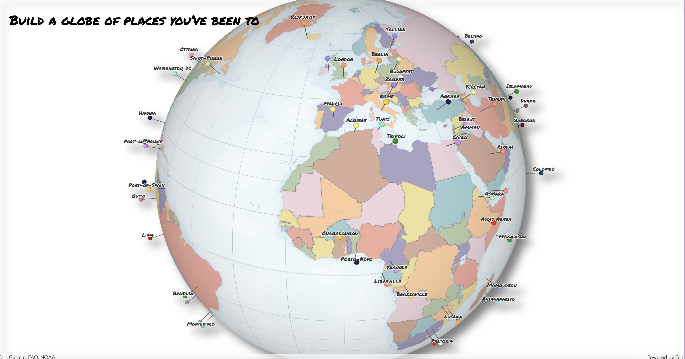

# Tutorial - Getting started with web 3D using ArcGIS API for JavaScript

In this tutorial you'll learn how to create a globe visualization of places you've been to. Something like this pin globe (the style is all up to you, you can get creative and style it totally different):



For this tutorial you'll need to have the data in [geojson](http://geojson.org/) format and like all things web, make sure to have `node` and `git` installed. It's useful if you have a [GitHub account](https://github.com/) so that we can host the code there and deploy it at the end on [GitHub Pages](https://pages.github.com/).

## Step 1: Set up the projet and development environment

### Set up your project

Create the folder for your project and inside it in the console run `npm init`. Fill up project name, keywords, author, etc.
This will generate a `package.json` file.

### Set up a git repo

In the terminal run `git init` in the root folder. Create a `.gitignore` file and add
```
node_modules/*
.DS_Store
```
to exclude them from `git`.

### Set up app structure

Create an `index.html` file and an `app` folder that will store the JS/TS code and a style folder that will store the CSS.

- index.html
- app -> main.js
- style -> main.css

### Set up TypeScript

```
npm install --save-dev typescript
npm install --save @types/arcgis-js-api
```

Add `tsconfig.json` file with the following configuration:

```js
{
  "compilerOptions": {
    "module": "amd",
    "noImplicitAny": true,
    "sourceMap": true,
    "jsx": "react",
    "jsxFactory": "tsx",
    "target": "es5",
    "esModuleInterop": true,
    "experimentalDecorators": true,
    "preserveConstEnums": true,
    "suppressImplicitAnyIndexErrors": true
  },
  "include": [
    "./app/*"
  ],
  "exclude": [
    "node_modules"
  ]
}
```

Add a script in `package.json` to watch for changes and compile everytime a `.ts` file changes:

```js
  ...,
  "scripts": {
    "tsc": "tsc -w" // compiles and watches for changes
  },
```

You can find a detailed description of this step [here](https://developers.arcgis.com/javascript/latest/guide/typescript-setup/index.html).

To test this, change `main.js` file to `main.ts` and run `npm run tsc`. This will compile the files and watch for changes.

### Set up a linter for TypeScript

Install the tool needed for linting:

`npm install --save-dev tslint`

You can read more about the tool [here](https://palantir.github.io/tslint/).
Set up the linting rules in a `tslint.json` file. The rules that I use in this project are the ones that we also use when developing the API:
https://github.com/Esri/jsapi-resources/blob/master/4.x/typescript/demo/tslint.json.

Copy the `tslint.json` file in the root of the project and create a script to run the command from the command lint:

```js
  "scripts": {
    ...,
    "lint": "tslint app/**/*.ts"
  },
```

You can run this command if you want to check for syntax errors in your code.
